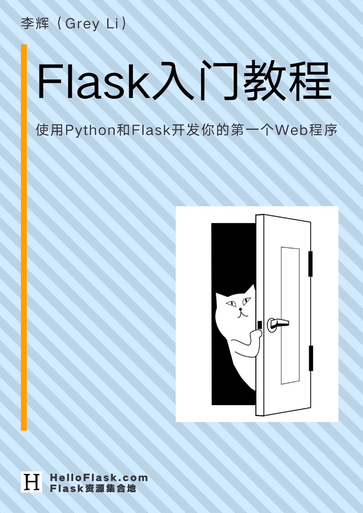

# Flask Tutorial

English | [简体中文](README.zh-CN.md)

> Build your first web application with Python and Flask

This is the source repository for *Flask Tutorial*. Visit the [book homepage](https://helloflask.com/en/book/3) to read it online.

If you find an error or have feedback or suggestions, please [open an issue](https://github.com/helloflask/flask-tutorial/issues/new) or submit a pull request with a correction. For substantial changes, please [open an issue](https://github.com/helloflask/flask-tutorial/issues/new) first to discuss them. Thank you!

© 2018 - 2025 [Grey Li (李辉)](http://greyli.com) / [HelloFlask](http://helloflask.com)

This book is licensed under [CC BY-NC-ND 3.0](https://creativecommons.org/licenses/by-nc-nd/3.0/deed.en). Commercial use, redistribution of modified versions, and redistribution without attribution are not permitted.

## Contributing

See the [contributing guide](CONTRIBUTING.md) for instructions on building both language editions, translating chapters, and deploying with Netlify.
