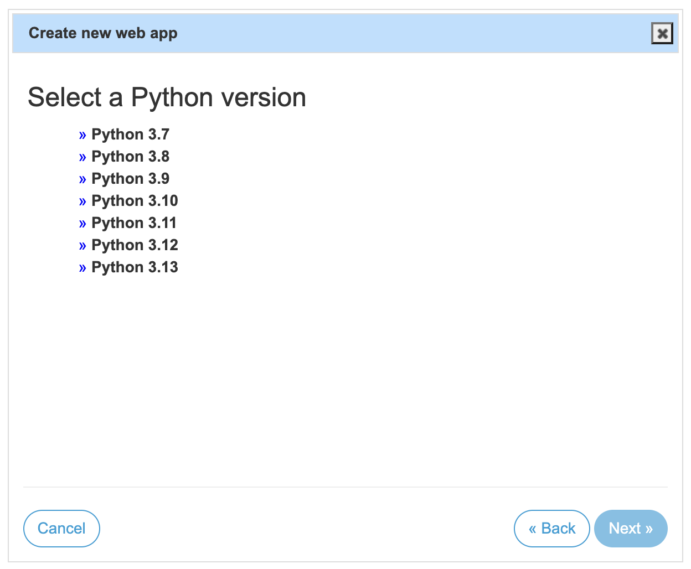
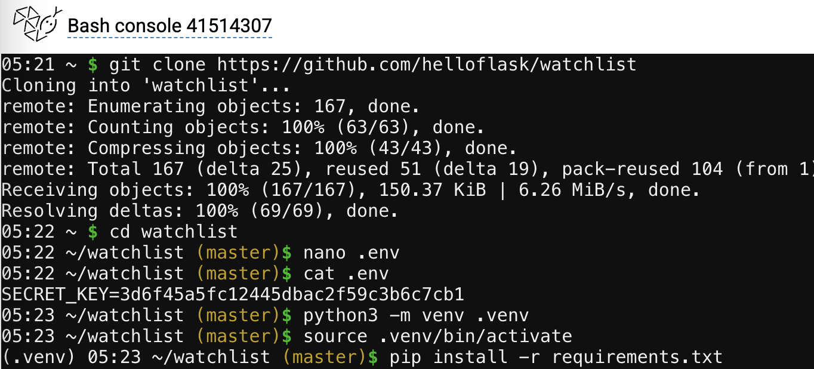
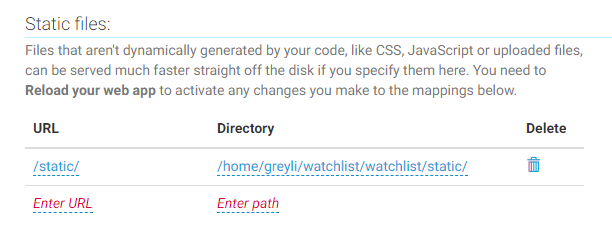
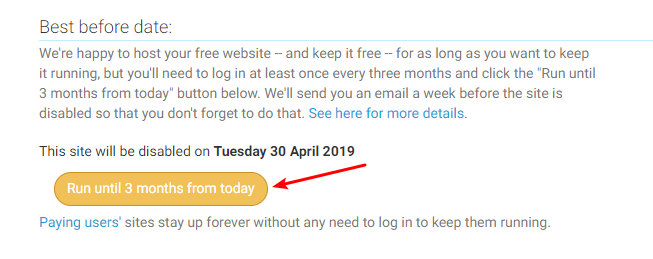

# 第 11 章：部署上线

在这个教程的最后一章，我们将会把程序部署到互联网上，让网络中的其他所有人都可以访问到。

Web 程序通常有两种部署方式：传统部署和云部署。传统部署指的是在使用物理主机或虚拟主机上部署程序，你通常需要在一个 Linux 系统上完成所有的部署操作；云部署则是使用其他公司提供的云平台，这些平台为你设置好了底层服务，包括 Web 服务器、数据库等等，你只需要上传代码并进行一些简单设置即可完成部署。这一章我们会介绍使用云平台 [PythonAnywhere](https://www.pythonanywhere.com) 来部署程序。


## 部署前的准备

首先，我们需要生成一个依赖列表，方便在部署环境里安装。使用下面的命令把当前依赖列表写到一个 requirements.txt 文件里：

```bash
(.venv) $ pip freeze > requirements.txt
```

对于某些配置，生产环境下需要使用不同的值。这是我们之前为生产环境创建的配置类：

```python
class ProductionConfig(BaseConfig):
    SQLALCHEMY_DATABASE_URI = os.getenv('DATABASE_URL', SQLITE_PREFIX + str(BASE_DIR / 'data.db'))
```

在示例程序里，因为我们部署后将继续使用 SQLite，所以只需要为生产环境设置不同的数据库文件名。另外，继承自 BaseConfig 的配置 SECRET_KEY 需要改为使用随机字符：

```python
class BaseConfig:
    SECRET_KEY = os.getenv('SECRET_KEY', 'dev')
```

在生产环境，为了安全考虑，需要把具体的值作为环境变量定义，而不是放到代码里。我们将在远程服务器环境创建新的 .env 文件写入 SECRET_KEY 的值，具体将在下一节介绍。

在部署程序时，我们不会使用 Flask 内置的开发服务器运行程序，因此，对于写到 .env 文件的环境变量，我们需要手动使用 python-dotenv 导入。下面在项目根目录创建一个 wsgi.py 脚本，作为生产环境的程序入口脚本。我们在这个脚本中加载环境变量，并创建程序实例以供部署时使用：

*wsgi.py：手动设置环境变量并创建程序实例*

```python
import os

from dotenv import load_dotenv

dotenv_path = os.path.join(os.path.dirname(__file__), '.env')
if os.path.exists(dotenv_path):
    load_dotenv(dotenv_path)

from watchlist import create_app

app = create_app(config_name='production')
```

最后让我们把改动提交到 Git 仓库，并推送到 GitHub 上的远程仓库：

```bash
$ git add .
$ git commit -m "Ready to deploy"
$ git push
```

## 使用 PythonAnywhere 部署程序

首先访问[注册页面](https://www.pythonanywhere.com/registration/register/beginner/)注册一个免费账户。注册时填入的用户名将作为你的程序域名的子域部分，以及分配给你的 Linux 用户名。比如，如果你的用户名为 greyli，最终为你分配的程序域名就是 <http://greyli.pythonanywhere.com/>。

注册完成后会有一个简单的教程，你可以跳过，也可以跟着了解一下基本用法。管理面板（Dashboard）主页如下所示：


导航栏包含几个常用的链接，可以打开其他面板：

- Consoles（控制台）：可以打开 Bash、Python Shell、MySQL 等常用的控制台
- Files（文件）：创建、删除、编辑、上传文件，你可以在这里直接修改代码
- Web：管理 Web 程序
- Tasks（任务）：创建计划任务
- Databases（数据库）：设置数据库，免费账户可以使用 MySQL

这些链接对应页面的某些功能也可以直接在管理面板主页对应部分打开。

我们需要先来创建一个 Web 程序，你可以点击导航栏的 Web 链接，或是主页上的“Open Web tab”按钮打开 Web 面板：


点击“Add a new web app”按钮创建 Web 程序，第一步提示升级账户后可以自定义域名，我们直接点击“Next”按钮跳到下一步：


这一步选择 Web 框架，为了获得更灵活的控制，选择手动设置（Manual configuration）：


接着选择你想使用的 Python 版本（最低需要 3.9 版本）：



最后点击“Next”按钮即可完成创建 Web 程序流程：


接下来我们需要进行一系列程序初始化操作，最后再回到 Web 面板进行具体的设置。


## 初始化程序运行环境

我们首先要考虑把代码上传到 PythonAnywhere 的服务器上。上传代码一般有两种方式：

* 从 GitHub 拉取我们的程序
* 在本地将代码存储为压缩文件，然后在 Files 标签页上传压缩包

因为我们的代码已经推送到 GitHub 上，这里将采用第一种方式。首先通过管理面板主页的“Bash”按钮或是 Consoles 面板下的“Bash”链接创建一个命令行会话，后续的命令都需要在新打开的会话中执行：


在命令行下输入下面的命令：

```bash
$ git clone https://github.com/helloflask/watchlist  # 注意替换 Git 仓库地址
$ cd watchlist  # 切换进程序仓库
```

这会把程序代码克隆到 PythonAnywhere 为你分配的用户目录中，路径即 `/home/你的 PythonAnywhere 用户名/你的仓库名称`，比如 `/home/greyli/watchlist`。

注意替换 git clone 命令后的 Git 地址，将 `helloflask` 替换为你的 GitHub 用户名，将 `watchlist` 替换为你的仓库名称。

> **提示** 如果你在 GitHub 上的仓库类型为私有仓库，那么需要将 PythonAnywhere 服务器的 SSH 密钥添加到 GitHub 账户中，具体参考第 1 章“设置 SSH 密钥”小节。

下面我们在项目根目录创建 .env 文件，并写入生产环境下需要设置的环境变量。密钥（`SECRET_KEY`）的值需要为随机字符串，我们可以使用 uuid 模块来生成。在你本地的终端中打开 Python Shell 并执行相应代码：

```python
$ python3
>>> import uuid
>>> uuid.uuid4().hex
'3d6f45a5fc12445dbac2f59c3b6c7cb1'
```

复制生成的随机字符备用，接着回到 PythonAnywhere 上打开的命令行会话，执行下面的命令创建 .env 文件：

```bash
$ nano .env
```

写入设置密钥的环境变量（按下 Control+O 和 Enter 保存，然后按下 Control+X 退出）：

```ini
SECRET_KEY=3d6f45a5fc12445dbac2f59c3b6c7cb1
```

最后安装依赖并执行初始化操作：

```bash
$ python3 -m venv .venv  # 创建虚拟环境
$ source .venv/bin/activate  # 激活虚拟环境
(.venv) $ pip install -r requirements.txt  # 安装所有依赖
(.venv) $ flask init-db  # 初始化数据库，也可以执行 flask forge 创建虚拟数据
(.venv) $ flask admin  # 创建管理员账户
```

你的命令行窗口和依次输入的命令（省略了后两条命令）类似下图：



先不要关闭这个标签页，后面我们还要在这里执行一些命令。点击右上角的菜单按钮，并在浏览器的后台标签页打开 Web 面板。


## 设置并启动程序

代码部分我们已经设置完毕，接下来进行一些简单设置就可以启动程序了。


### 代码

切换到 Web 面板（标签页），先来设置 Code 部分的配置：


点击源码（Source code）和工作目录（Working directory）后的路径并填入项目根目录，目录规则为“/home/用户名/项目文件夹名”。

点击 WSGI 配置文件（WSGI configuration file）后的链接打开编辑页面，删掉这个文件内的所有内容，填入下面的代码：

```python
import sys

path = '/home/greyli/watchlist'  # 路径规则为 /home/你的用户名/项目文件夹名
if path not in sys.path:
    sys.path.append(path)

from wsgi import app as application
```

完成后点击绿色的 Save 按钮或按下 Ctrl+S 保存修改，点击右上角的菜单按钮返回 Web 面板。

PythonAnywhere 会自动从这个文件里导入名称为 `application` 的程序实例，所以我们从项目目录的 wsgi 模块中导入程序实例 `app`，并将名称映射为 `application`。


### 虚拟环境

为了让程序正确运行，我们需要在 Virtualenv 部分填入虚拟环境文件夹的路径：


对应我们的项目就是 `/home/greyli/watchlist/.venv/`，注意替换其中的用户名、项目名称和虚拟环境名称部分。点击 Virtualenv 部分的红色字体链接，填入并保存。


### 静态文件

静态文件可以交给 PythonAnywhere 设置的 Web 服务器来处理，这样处理性能会更好。要让 PythonAnywhere 处理静态文件，我们只需要在 Static files 部分指定静态文件 URL 和对应的静态文件文件夹目录，如下所示：



Flask 程序的静态文件默认 URL 为“/static”，因此这里的 URL 填入“/static/”；对应的目录是程序包里的静态文件夹，比如“/home/greyli/watchlist/watchlist/static/”。注意更新目录中的用户名和项目文件夹名称。


### 启动程序

一切就绪，点击绿色的重载（Reload）按钮即可让配置生效：


现在访问你的程序网址“<https://用户名.pythonanywhere.com>”（可以在 Web 面板顶部找到链接），比如 <https://greyli.pythonanywhere.com> 即可访问程序。

最后还要注意的是，免费账户需要每三个月点击一次黄色的激活按钮（在过期前你会收到提醒邮件）：




## 更新部署后的程序

当你需要更新程序时，流程和部署类似。在本地完成更新，确保程序通过测试后，将代码推送到 GitHub 上的远程仓库。然后登录到 PythonAnywhere，打开一个命令行会话（Bash），切换到项目目录，使用 git pull 命令从远程仓库拉取更新：

```bash
$ cd watchlist
$ git pull
```

然后你可以执行一些必要的操作，比如安装新的依赖等等。最后在 Web 面板点击绿色的重载（Reload）按钮即可完成更新。


## 本章小结

程序部署上线以后，你可以考虑继续为它开发新功能，也可以从零编写一个新的程序。虽然本书即将接近尾声，但你的学习之路才刚刚开始，因为本书只是介绍了 Flask 入门所需的基础知识，你还需要进一步学习。在后记中，你可以看到进一步学习的推荐读物。

接下来，还有一个挑战在等着你。


## 进阶提示

*  因为 PythonAnywhere 支持在线管理文件、编辑代码、执行命令，你可以在学习编程的过程中使用它来在线开发 Web 程序。
*  PythonAnywhere 的 Web 面板还有一些功能设置：Log files 部分可以查看你的程序日志，Traffic 部分显示了你的程序访问流量情况，Security 部分可以为你的程序程序开启强制启用 HTTPS 和密码保护。

