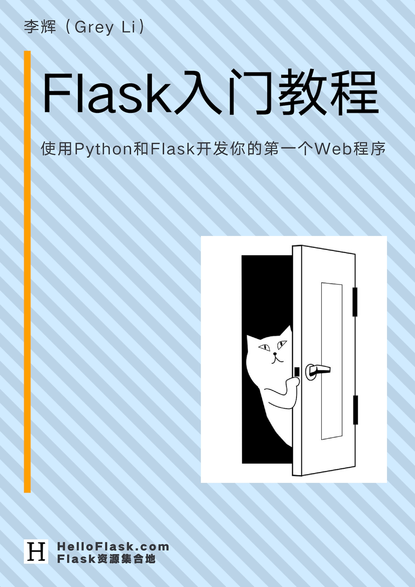

# Flask 入门教程

当前版本：4.0（2025/10/12）

## 目录

* [前言](preface.md)
* [为本书付费](pay.md)
* [第 1 章：准备工作](1-preparation.md)
* [第 2 章：Hello, Flask!](2-hello.md)
* [第 3 章：模板](3-template.md)
* [第 4 章：静态文件](4-static.md)
* [第 5 章：数据库](5-database.md)
* [第 6 章：模板优化](6-advanced-template.md)
* [第 7 章：表单](7-form.md)
* [第 8 章：用户认证](8-auth.md)
* [第 9 章：组织你的代码](9-organize.md)
* [第 10 章：测试](10-test.md)
* [第 11 章：部署上线](11-deployment.md)
* [第 12 章：小挑战](12-challenge.md)
* [后记](postscript.md)

## 版权信息

Flask 入门教程：使用 Python 和 Flask 开发你的第一个 Web 程序

Copyright © 2018 - 2025 [李辉](http://greyli.com)（Grey Li）

本书采用 [CC BY-NC-ND 3.0](https://creativecommons.org/licenses/by-nc-nd/3.0/deed.zh) 协议授权，禁止商用、演绎后分发或无署名转载。
