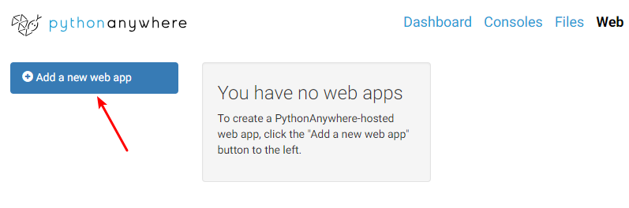
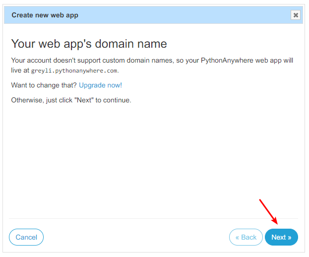
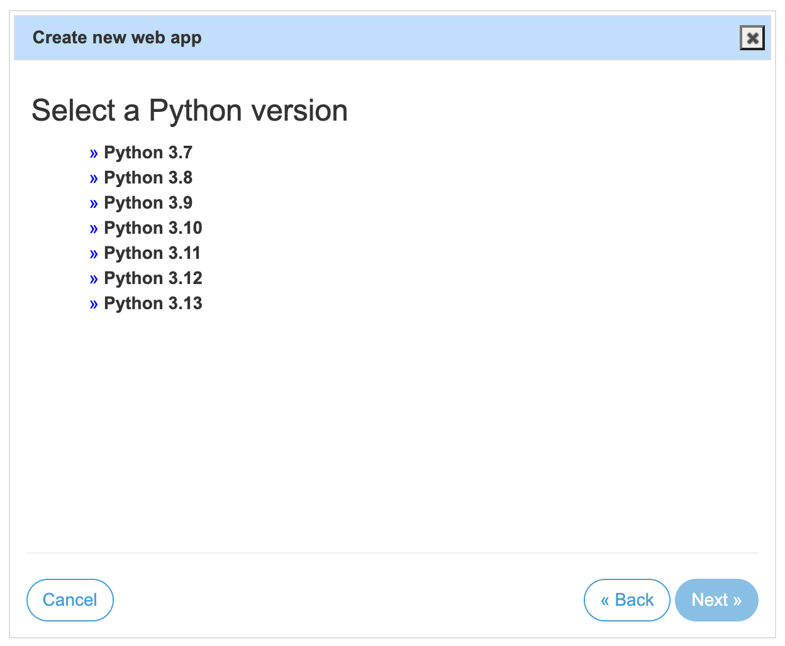
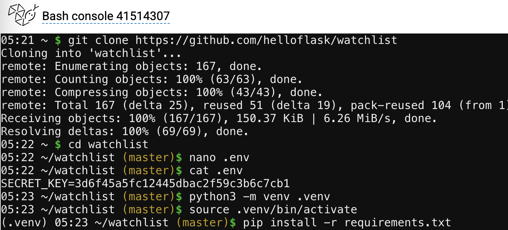
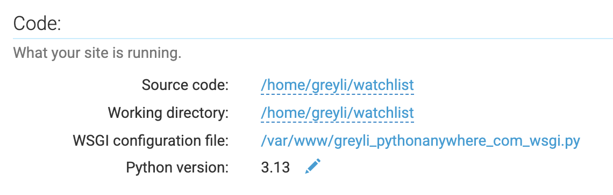
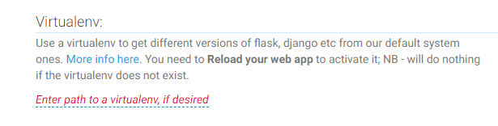
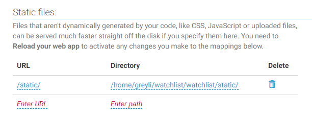
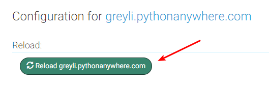

# 第 11 章：部署上线

在这个教程的最后一章，我们将会把程序部署到互联网上，让网络中的其他所有人都可以访问到。

Web 程序通常有两种部署方式：传统部署和云部署。传统部署指的是在使用物理主机或虚拟主机上部署程序，你通常需要在一个 Linux 系统上完成所有的部署操作；云部署则是使用其他公司提供的云平台，这些平台为你设置好了底层服务，包括 Web 服务器、数据库等等，你只需要上传代码并进行一些简单设置即可完成部署。这一章我们会介绍使用云平台 [PythonAnywhere](https://www.pythonanywhere.com) 来部署程序。


## 部署前的准备

首先，我们需要生成一个依赖列表，方便在部署环境里安装。使用下面的命令把当前依赖列表写到一个 requirements.txt 文件里：

```bash
(env) $ pip freeze > requirements.txt
```

对于某些配置，生产环境下需要使用不同的值。为了让配置更加灵活，我们把需要在生产环境下使用的配置改为优先从环境变量中读取，如果没有读取到，则使用默认值：

```python
app.config['SECRET_KEY'] = os.getenv('SECRET_KEY', 'dev')
app.config['SQLALCHEMY_DATABASE_URI'] = prefix + os.path.join(os.path.dirname(app.root_path), os.getenv('DATABASE_FILE', 'data.db'))
```

以第一个配置变量为例，`os.getenv('SECRET_KEY', 'dev')` 表示读取系统环境变量 `SECRET_KEY` 的值，如果没有获取到，则使用 `dev`。

> **注意** 像密钥这种敏感信息，保存到环境变量中要比直接写在代码中更加安全。

对于第二个配置变量，我们仅改动了最后的数据库文件名。在示例程序里，因为我们部署后将继续使用 SQLite，所以只需要为生产环境设置不同的数据库文件名，否则的话，你可以像密钥一样设置优先从环境变量读取整个数据库 URL。

在部署程序时，我们不会使用 Flask 内置的开发服务器运行程序，因此，对于写到 .env 文件的环境变量，我们需要手动使用 python-dotenv 导入。下面在项目根目录创建一个 wsgi.py 脚本，在这个脚本中加载环境变量，并导入程序实例以供部署时使用：

*wsgi.py：手动设置环境变量并导入程序实例*

```python
import os

from dotenv import load_dotenv

dotenv_path = os.path.join(os.path.dirname(__file__), '.env')
if os.path.exists(dotenv_path):
    load_dotenv(dotenv_path)

from watchlist import app
```

这两个环境变量的具体定义，我们将在远程服务器环境创建新的 .env 文件写入。

最后让我们把改动提交到 Git 仓库，并推送到 GitHub 上的远程仓库：

```bash
$ git add .
$ git commit -m "Ready to deploy"
$ git push
```

> **提示** 你可以在 GitHub 上查看本书示例程序的对应 commit：[92eabc8](https://github.com/helloflask/watchlist/commit/92eabc89a669a8b3e2d2a56177a875938923fd52)。


## 使用 PythonAnywhere 部署程序

首先访问[注册页面](https://www.pythonanywhere.com/registration/register/beginner/)注册一个免费账户。注册时填入的用户名将作为你的程序域名的子域部分，以及分配给你的 Linux 用户名。比如，如果你的用户名为 greyli，最终为你分配的程序域名就是 <http://greyli.pythonanywhere.com/>。

注册完成后会有一个简单的教程，你可以跳过，也可以跟着了解一下基本用法。管理面板主页如下所示：


导航栏包含几个常用的链接，可以打开其他面板：

- Consoles（控制台）：可以打开 Bash、Python Shell、MySQL 等常用的控制台
- Files（文件）：创建、删除、编辑、上传文件，你可以在这里直接修改代码
- Web：管理 Web 程序
- Tasks（任务）：创建计划任务
- Databases（数据库）：设置数据库，免费账户可以使用 MySQL

这些链接对应页面的某些功能也可以直接在管理面板主页打开。

我们需要先来创建一个 Web 程序，你可以点击导航栏的 Web 链接，或是主页上的“Open Web tab”按钮打开 Web 面板：



点击“Add a new web app”按钮创建 Web 程序，第一步提示升级账户后可以自定义域名，我们直接点击“Next”按钮跳到下一步：



这一步选择 Web 框架，为了获得更灵活的控制，选择手动设置（Manual configuration）：


接着选择你想使用的 Python 版本：



最后点击“Next”按钮即可完成创建 Web 程序流程：


接下来我们需要进行一系列程序初始化操作，最后再回到 Web 面板进行具体的设置。


## 初始化程序运行环境

我们首先要考虑把代码上传到 PythonAnywhere 的服务器上。上传代码一般有两种方式：

* 从 GitHub 拉取我们的程序
* 在本地将代码存储为压缩文件，然后在 Files 标签页上传压缩包

因为我们的代码已经推送到 GitHub 上，这里将采用第一种方式。首先通过管理面板主页的“Bash”按钮或是 Consoles 面板下的“Bash”链接创建一个命令行会话：


在命令行下输入下面的命令：

```bash
$ git clone https://github.com/helloflask/watchlist  # 注意替换 Git 仓库地址
$ cd watchlist  # 切换进程序仓库
```

这会把程序代码克隆到 PythonAnywhere 为你分配的用户目录中，路径即 `/home/你的 PythonAnywhere 用户名/你的仓库名称`，比如 `/home/greyli/watchlist`。

注意替换 git clone 命令后的 Git 地址，将 `greyli` 替换为你的 GitHub 用户名，将 `watchlist` 替换为你的仓库名称。

> **提示** 如果你在 GitHub 上的仓库类型为私有仓库，那么需要将 PythonAnywhere 服务器的 SSH 密钥添加到 GitHub 账户中，具体参考第 1 章“设置 SSH 密钥”小节。

下面我们在项目根目录创建 .env 文件，并写入生产环境下需要设置的两个环境变量。其中，密钥（`SECRET_KEY`）的值是随机字符串，我们可以使用 uuid 模块来生成：

```python
$ python3
>>> import uuid
>>> uuid.uuid4().hex
'3d6f45a5fc12445dbac2f59c3b6c7cb1'
```

复制生成的随机字符备用，接着创建 .env 文件：

```bash
$ nano .env
```

写入设置密钥和数据库名称的环境变量：

```ini
SECRET_KEY=3d6f45a5fc12445dbac2f59c3b6c7cb1
DATABASE_FILE=data-prod.db
```

最后安装依赖并执行初始化操作：

```bash
$ python3 -m venv env  # 创建虚拟环境
$ . env/bin/activate  # 激活虚拟环境
(env) $ pip install -r requirements.txt  # 安装所有依赖
(env) $ flask initdb  # 初始化数据库
(env) $ flask admin  # 创建管理员账户
```

先不要关闭这个标签页，后面我们还要在这里执行一些命令。点击右上角的菜单按钮，并在浏览器的新标签页打开 Web 面板。


## 设置并启动程序

代码部分我们已经设置完毕，接下来进行一些简单设置就可以启动程序了。


### 代码

回到 Web 标签页，先来设置 Code 部分的配置：



点击源码（Source code）和工作目录（Working directory）后的路径并填入项目根目录，目录规则为“/home/用户名/项目文件夹名”。

点击 WSGI 配置文件（WSGI configuration file）后的链接打开编辑页面，删掉这个文件内的所有内容，填入下面的代码：

```python
import sys

path = '/home/greyli/watchlist'  # 路径规则为 /home/你的用户名/项目文件夹名
if path not in sys.path:
    sys.path.append(path)

from wsgi import app as application
```

完成后点击绿色的 Save 按钮或按下 Ctrl+S 保存修改，点击右上角的菜单按钮返回 Web 面板。

PythonAnywhere 会自动从这个文件里导入名称为 `application` 的程序实例，所以我们从项目目录的 wsgi 模块中导入程序实例 `app`，并将名称映射为 `application`。


### 虚拟环境

为了让程序正确运行，我们需要在 Virtualenv 部分填入虚拟环境文件夹的路径：



对应我们的项目就是 `/home/greyli/watchlist/env/`，注意替换其中的用户名、项目名称和虚拟环境名称部分。点击 Virtualenv 部分的红色字体链接，填入并保存。


### 静态文件

静态文件可以交给 PythonAnywhere 设置的服务器来处理，这样会更高效。要让 PythonAnywhere 处理静态文件，我们只需要在 Static files 部分指定静态文件 URL 和对应的静态文件文件夹目录，如下所示：



注意更新目录中的用户名和项目文件夹名称。


### 启动程序

一切就绪，点击绿色的重载按钮即可让配置生效：



现在访问你的程序网址“<https://用户名.pythonanywhere.com>”（Web 面板顶部的链接），比如 <https://greyli.pythonanywhere.com> 即可访问程序。

最后还要注意的是，免费账户需要每三个月点击一次黄色的激活按钮（在过期前你会收到提醒邮件）：




## 更新部署后的程序

当你需要更新程序时，流程和部署类似。在本地完成更新，确保程序通过测试后，将代码推送到 GitHub 上的远程仓库。登录到 PythonAnywhere，打开一个命令行会话（Bash），切换到项目目录，使用 git pull 命令从远程仓库拉取更新：

```bash
$ cd watchlist
$ git pull
```

然后你可以执行一些必要的操作，比如安装新的依赖等等。最后在 Web 面板点击绿色的重载（Reload）按钮即可完成更新。


## 本章小结

程序部署上线以后，你可以考虑继续为它开发新功能，也可以从零编写一个新的程序。虽然本书即将接近尾声，但你的学习之路才刚刚开始，因为本书只是介绍了 Flask 入门所需的基础知识，你还需要进一步学习。在后记中，你可以看到进一步学习的推荐读物。

接下来，有一个挑战在等着你。


## 进阶提示

*  因为 PythonAnywhere 支持在线管理文件、编辑代码、执行命令，你可以在学习编程的过程中使用它来在线开发 Web 程序。
*  PythonAnywhere 的 Web 面板还有一些功能设置：Log files 部分可以查看你的程序日志，Traffic 部分显示了你的程序访问流量情况，Security 部分可以为你的程序程序开启强制启用 HTTPS 和密码保护。
*  如果你是[《Flask Web 开发实战》](http://helloflask.com/book/1)的读者，第 14 章详细介绍了部署 Flask 程序的两种方式：传统部署和云部署。
