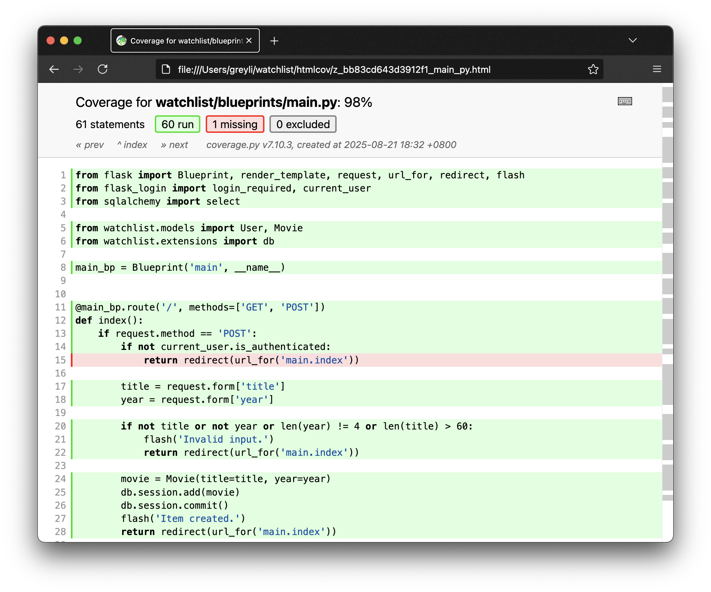

# 第 9 章：测试

在此之前，每次为程序添加了新功能，我们都要手动在浏览器里访问程序进行测试。除了测试新添加的功能，你还要确保旧的功能依然正常工作。在功能复杂的大型程序里，如果每次修改代码或添加新功能后手动测试所有功能，那会产生很大的工作量。另一方面，手动测试并不可靠，重复进行测试操作也很枯燥。

基于这些原因，为程序编写自动化测试就变得非常重要。

> **注意** 为了便于介绍，本书统一在这里介绍关于测试的内容。在实际的项目开发中，你应该在开发每一个功能后立刻编写相应的测试，确保测试通过后再开发下一个功能。


## 单元测试

单元测试指对程序中的函数等独立单元编写的测试，它是自动化测试最主要的形式。这一章我们将会使用 Python 标准库中的测试框架 unittest 来编写单元测试，首先通过一个简单的例子来了解一些基本概念。假设我们编写了下面这个函数，并保存到一个 hello.py 模块里：

```python
def sayhello(to=None):
    if to:
        return f'Hello, {to}!'
    return 'Hello!'
```

下面是我们为这个函数编写的单元测试：

```python
import unittest

from hello import sayhello


class SayHelloTestCase(unittest.TestCase):  # 测试用例

    def setUp(self):  # 测试固件
        pass

    def tearDown(self):  # 测试固件
        pass

    def test_sayhello(self):  # 第 1 个测试
        rv = sayhello()
        self.assertEqual(rv, 'Hello!')
       
    def test_sayhello_to_somebody(self):  # 第 2 个测试
        rv = sayhello(to='Grey')
		self.assertEqual(rv, 'Hello, Grey!')


if __name__ == '__main__':
    unittest.main()
```

测试用例继承 `unittest.TestCase` 类，在这个类中创建的以 `test_` 开头的方法将会被视为测试方法。

内容为空的两个方法很特殊，它们是测试固件，用来执行一些特殊操作。比如 `setUp()` 方法会在每个测试方法执行前被调用，而 `tearDown()` 方法则会在每一个测试方法执行后被调用（注意这两个方法名称的大小写）。

如果把执行测试方法比作战斗，那么准备弹药、规划战术的工作就要在 `setUp()` 方法里完成，而打扫战场则要在 `tearDown()` 方法里完成。

每一个测试方法（名称以 `test_`  开头的方法）对应一个要测试的函数 / 功能 / 使用场景。在上面我们创建了两个测试方法，`test_sayhello()` 方法测试 `sayhello()` 函数，`test_sayhello_to_somebody()` 方法测试传入参数时的 `sayhello()` 函数。

在测试方法里，我们使用断言方法来判断程序功能是否正常。以第一个测试方法为例，我们先把 `sayhello()` 函数调用的返回值保存为 `rv` 变量（return value），然后使用 `self.assertEqual(rv, 'Hello!')` 来判断返回值内容是否符合预期。如果断言方法出错，就表示该测试方法未通过。

下面是一些常用的断言方法：

- assertEqual(a, b) 
- assertNotEqual(a, b) 
- assertTrue(x) 
- assertFalse(x) 
- assertIs(a, b) 
- assertIsNot(a, b) 
- assertIsNone(x) 
- assertIsNotNone(x) 
- assertIn(a, b) 
- assertNotIn(a, b) 

这些方法的作用从方法名称上基本可以得知。

假设我们把上面的测试代码保存到 test_sayhello.py 文件中，通过执行 `python test_sayhello.py` 命令即可执行所有测试，并输出测试的结果、通过情况、总耗时等信息。

## 测试 Flask 程序

回到我们的程序，我们在项目根目录创建一个 test_watchlist.py 脚本来存储测试代码，我们先编写测试固件和两个简单的基础测试：

*test_watchlist.py：测试固件*

```python
import unittest

from app import app, db, Movie, User


class WatchlistTestCase(unittest.TestCase):

    def setUp(self):
        # 更新配置
        app.config.update(
            TESTING=True,
            SQLALCHEMY_DATABASE_URI='sqlite:///:memory:'
        )
        # 创建数据库和表
        db.create_all()
        # 创建测试数据，一个用户，一个电影条目
        user = User(name='Test', username='test')
        user.set_password('123')
        movie = Movie(title='Test Movie Title', year='2019')
        # 使用 add_all() 方法一次添加多个模型类实例，传入列表
        db.session.add_all([user, movie])
        db.session.commit()

        self.client = app.test_client()  # 创建测试客户端
        self.runner = app.test_cli_runner()  # 创建测试命令运行器

    def tearDown(self):
        db.session.remove()  # 清除数据库会话
        db.drop_all()  # 删除数据库表
    
    # 测试程序实例是否存在
    def test_app_exist(self):
        self.assertIsNotNone(app)

    # 测试程序是否处于测试模式
    def test_app_is_testing(self):
        self.assertTrue(app.config['TESTING'])
```

某些配置，在开发和测试时通常需要使用不同的值。在 `setUp()` 方法中，我们更新了两个配置变量的值，首先将 `TESTING` 设为 `True` 来开启测试模式，这样在出错时不会输出多余信息；然后将 `SQLALCHEMY_DATABASE_URI` 设为 `'sqlite:///:memory:'`，这会使用 SQLite 内存型数据库，不会干扰开发时使用的数据库文件。你也可以使用不同文件名的 SQLite 数据库文件，但内存型数据库速度更快。

接着，我们调用 `db.create_all()` 创建数据库和表，然后添加测试数据到数据库中。在 `setUp()` 方法最后创建的两个类属性分别为测试客户端和测试命令运行器，前者用来模拟客户端请求，后者用来触发自定义命令，下一节会详细介绍。

在 `tearDown()` 方法中，我们调用 `db.session.remove()` 清除数据库会话并调用 `db.drop_all()` 删除数据库表。测试时的程序状态和真实的程序运行状态不同，所以需要调用 `db.session.remove()` 来确保数据库会话被清除。


### 测试客户端

`app.test_client()` 返回一个测试客户端对象，可以用来模拟客户端（浏览器），我们创建类属性 `self.client` 来保存它。对它调用 `get()` 方法就相当于浏览器向服务器发送 GET 请求，调用 `post()` 则相当于浏览器向服务器发送 POST 请求，以此类推。下面是两个发送 GET 请求的测试方法，分别测试 404 页面和主页：

*test_watchlist.py：测试固件*

```python
class WatchlistTestCase(unittest.TestCase):
    # ...
    # 测试 404 页面
    def test_404_page(self):
        response = self.client.get('/nothing')  # 传入目标 URL
        data = response.get_data(as_text=True)
        self.assertIn('Page Not Found - 404', data)
        self.assertIn('Go Back', data)
        self.assertEqual(response.status_code, 404)  # 判断响应状态码
    
    # 测试主页
    def test_index_page(self):
        response = self.client.get('/')
        data = response.get_data(as_text=True)
        self.assertIn('Test\'s Watchlist', data)
        self.assertIn('Test Movie Title', data)
        self.assertEqual(response.status_code, 200)
```

调用这类方法返回包含响应数据的响应对象，对这个响应对象调用 `get_data()` 方法并把 `as_text` 参数设为 `True` 可以获取 Unicode 格式的响应主体。我们通过判断响应主体中是否包含预期的内容来测试程序是否正常工作，比如 404 页面响应是否包含 Go Back，主页响应是否包含标题 Test's Watchlist。

接下来，我们要测试数据库操作相关的功能，比如创建、更新和删除电影条目。这些操作对应的请求都需要登录账户后才能发送，我们先编写一个用于登录账户的辅助方法：

*test_watchlist.py：测试辅助方法*

```python
class WatchlistTestCase(unittest.TestCase):
    # ...
    # 辅助方法，用于登入用户
    def login(self):
        self.client.post('/login', data=dict(
            username='test',
            password='123'
        ), follow_redirects=True)
```

在 `login()` 方法中，我们使用 `post()` 方法发送提交登录表单的 POST 请求。和 `get()` 方法类似，我们需要先传入目标 URL，然后使用 `data` 关键字以字典的形式传入请求数据（字典中的键为表单 `<input>` 元素的 `name` 属性值），作为登录表单的输入数据；而将 `follow_redirects` 参数设为 `True` 可以跟随重定向，最终返回的会是重定向后的响应。

下面是测试创建、更新和删除条目的测试方法：

*test_watchlist.py：测试创建、更新和删除条目*

```python
class WatchlistTestCase(unittest.TestCase):
    # ...
    # 测试创建条目
    def test_create_item(self):
        self.login()
        
        # 测试创建条目操作
        response = self.client.post('/', data=dict(
            title='New Movie',
            year='2019'
        ), follow_redirects=True)
        data = response.get_data(as_text=True)
        self.assertIn('Item created.', data)
        self.assertIn('New Movie', data)
        
        # 测试创建条目操作，但电影标题为空
        response = self.client.post('/', data=dict(
            title='',
            year='2019'
        ), follow_redirects=True)
        data = response.get_data(as_text=True)
        self.assertNotIn('Item created.', data)
        self.assertIn('Invalid input.', data)
        
        # 测试创建条目操作，但电影年份为空
        response = self.client.post('/', data=dict(
            title='New Movie',
            year=''
        ), follow_redirects=True)
        data = response.get_data(as_text=True)
        self.assertNotIn('Item created.', data)
        self.assertIn('Invalid input.', data)

    # 测试更新条目
    def test_update_item(self):
        self.login()
        
        # 测试更新页面
        response = self.client.get('/movie/edit/1')
        data = response.get_data(as_text=True)
        self.assertIn('Edit item', data)
        self.assertIn('Test Movie Title', data)
        self.assertIn('2019', data)
        
        # 测试更新条目操作
        response = self.client.post('/movie/edit/1', data=dict(
            title='New Movie Edited',
            year='2019'
        ), follow_redirects=True)
        data = response.get_data(as_text=True)
        self.assertIn('Item updated.', data)
        self.assertIn('New Movie Edited', data)
        
        # 测试更新条目操作，但电影标题为空
        response = self.client.post('/movie/edit/1', data=dict(
            title='',
            year='2019'
        ), follow_redirects=True)
        data = response.get_data(as_text=True)
        self.assertNotIn('Item updated.', data)
        self.assertIn('Invalid input.', data)
        
        # 测试更新条目操作，但电影年份为空
        response = self.client.post('/movie/edit/1', data=dict(
            title='New Movie Edited Again',
            year=''
        ), follow_redirects=True)
        data = response.get_data(as_text=True)
        self.assertNotIn('Item updated.', data)
        self.assertNotIn('New Movie Edited Again', data)
        self.assertIn('Invalid input.', data)

    # 测试删除条目
    def test_delete_item(self):
        self.login()
        
        response = self.client.post('/movie/delete/1', follow_redirects=True)
        data = response.get_data(as_text=True)
        self.assertIn('Item deleted.', data)
        self.assertNotIn('Test Movie Title', data)
```

在这几个测试方法中，大部分的断言都是在判断响应主体是否包含正确的提示消息和电影条目信息。

登录、登出和认证保护等功能的测试如下所示：

*test_watchlist.py：测试认证相关功能*

```python
class WatchlistTestCase(unittest.TestCase):
    # ...
    # 测试登录保护
    def test_login_protect(self):
        response = self.client.get('/')
        data = response.get_data(as_text=True)
        self.assertNotIn('Logout', data)
        self.assertNotIn('Settings', data)
        self.assertNotIn('<form method="post">', data)
        self.assertNotIn('Delete', data)
        self.assertNotIn('Edit', data)

    # 测试登录
    def test_login(self):
        response = self.client.post('/login', data=dict(
            username='test',
            password='123'
        ), follow_redirects=True)
        data = response.get_data(as_text=True)
        self.assertIn('Login success.', data)
        self.assertIn('Logout', data)
        self.assertIn('Settings', data)
        self.assertIn('Delete', data)
        self.assertIn('Edit', data)
        self.assertIn('<form method="post">', data)
        
        # 测试使用错误的密码登录
        response = self.client.post('/login', data=dict(
            username='test',
            password='456'
        ), follow_redirects=True)
        data = response.get_data(as_text=True)
        self.assertNotIn('Login success.', data)
        self.assertIn('Invalid username or password.', data)
        
        # 测试使用错误的用户名登录
        response = self.client.post('/login', data=dict(
            username='wrong',
            password='123'
        ), follow_redirects=True)
        data = response.get_data(as_text=True)
        self.assertNotIn('Login success.', data)
        self.assertIn('Invalid username or password.', data)
        
        # 测试使用空用户名登录
        response = self.client.post('/login', data=dict(
            username='',
            password='123'
        ), follow_redirects=True)
        data = response.get_data(as_text=True)
        self.assertNotIn('Login success.', data)
        self.assertIn('Invalid input.', data)
        
        # 测试使用空密码登录
        response = self.client.post('/login', data=dict(
            username='test',
            password=''
        ), follow_redirects=True)
        data = response.get_data(as_text=True)
        self.assertNotIn('Login success.', data)
        self.assertIn('Invalid input.', data)

    # 测试登出
    def test_logout(self):
        self.login()

        response = self.client.get('/logout', follow_redirects=True)
        data = response.get_data(as_text=True)
        self.assertIn('Goodbye.', data)
        self.assertNotIn('Logout', data)
        self.assertNotIn('Settings', data)
        self.assertNotIn('Delete', data)
        self.assertNotIn('Edit', data)
        self.assertNotIn('<form method="post">', data)
    
    # 测试设置
    def test_settings(self):
        self.login()
        
        # 测试设置页面
        response = self.client.get('/settings')
        data = response.get_data(as_text=True)
        self.assertIn('Settings', data)
        self.assertIn('Your Name', data)

        # 测试更新设置
        response = self.client.post('/settings', data=dict(
            name='Grey Li',
        ), follow_redirects=True)
        data = response.get_data(as_text=True)
        self.assertIn('Settings updated.', data)
        self.assertIn('Grey Li', data)

        # 测试更新设置，名称为空
        response = self.client.post('/settings', data=dict(
            name='',
        ), follow_redirects=True)
        data = response.get_data(as_text=True)
        self.assertNotIn('Settings updated.', data)
        self.assertIn('Invalid input.', data)
```


### 测试命令

除了测试程序的各个视图函数，我们还需要测试自定义命令。`app.test_cli_runner()` 方法返回一个命令运行器对象，我们创建类属性 `self.runner` 来保存它。通过对它调用 `invoke()` 方法可以执行命令，传入命令函数对象，或是使用 `args` 关键字直接给出命令参数列表。`invoke()` 方法返回的命令执行结果对象，它的 `output` 属性返回命令的输出信息。下面是我们为各个自定义命令编写的测试方法：

*test_watchlist.py：测试自定义命令行命令*

```python
# 导入命令函数
from app import app, db, Movie, User, forge, initdb


class WatchlistTestCase(unittest.TestCase):
    # ...
    # 测试虚拟数据
    def test_forge_command(self):
        result = self.runner.invoke(forge)
        self.assertIn('Done.', result.output)
        self.assertNotEqual(Movie.query.count(), 0)

    # 测试初始化数据库
    def test_initdb_command(self):
        result = self.runner.invoke(initdb)
        self.assertIn('Initialized database.', result.output)

    # 测试生成管理员账户
    def test_admin_command(self):
        db.drop_all()
        db.create_all()
        result = self.runner.invoke(args=['admin', '--username', 'grey', '--password', '123'])
        self.assertIn('Creating user...', result.output)
        self.assertIn('Done.', result.output)
        self.assertEqual(User.query.count(), 1)
        self.assertEqual(User.query.first().username, 'grey')
        self.assertTrue(User.query.first().validate_password('123'))

    # 测试更新管理员账户
    def test_admin_command_update(self):
        # 使用 args 参数给出完整的命令参数列表
        result = self.runner.invoke(args=['admin', '--username', 'peter', '--password', '456'])
        self.assertIn('Updating user...', result.output)
        self.assertIn('Done.', result.output)
        self.assertEqual(User.query.count(), 1)
        self.assertEqual(User.query.first().username, 'peter')
        self.assertTrue(User.query.first().validate_password('456'))
```

在这几个测试中，大部分的断言是在检查执行命令后的数据库数据是否发生了正确的变化，或是判断命令行输出（`result.output`）是否包含预期的字符。


### 运行测试

最后，我们在程序结尾添加下面的代码：

```python
if __name__ == '__main__':
    unittest.main()
```

使用下面的命令执行测试：

```bash
(env) $ python test_watchlist.py
...............
----------------------------------------------------------------------
Ran 15 tests in 2.942s

OK
```

如果测试出错，你会看到详细的错误信息，进而可以有针对性的修复对应的程序代码，或是调整测试方法。


## 测试覆盖率

为了让程序更加强壮，你可以添加更多、更完善的测试。那么，如何才能知道程序里有哪些代码还没有被测试？整体的测试覆盖率情况如何？我们可以使用 [Coverage.py](https://coverage.readthedocs.io/en/v4.5.x/) 来检查测试覆盖率，首先安装它：

```bash
(env) $ pip install coverage
```

使用下面的命令执行测试并检查测试覆盖率：

```bash
(env) $ coverage run --source=app test_watchlist.py
```

因为我们只需要检查程序脚本 app.py 的测试覆盖率，所以使用 `--source`  选项来指定要检查的模块或包。

最后使用下面的命令查看覆盖率报告：

```bash
$ coverage report
Name     Stmts   Miss  Cover
----------------------------
app.py     146      5    97%
```

从上面的表格可以看出，一共有 146 行代码，没测试到的代码有 5 行，测试覆盖率为 97%。

你还可以使用 coverage html 命令获取详细的 HTML 格式的覆盖率报告，它会在当前目录生成一个 htmlcov 文件夹，打开其中的 index.html 即可查看覆盖率报告。点击文件名可以看到具体的代码覆盖情况，如下图所示：



同时在 .gitignore 文件后追加下面两行，忽略掉生成的覆盖率报告文件：

```
htmlcov/
.coverage
```


## 本章小结

通过测试后，我们就可以准备上线程序了。结束前，让我们提交代码：

```bash
$ git add .
$ git commit -m "Add unit test with unittest"
$ git push
```

> **提示** 你可以在 GitHub 上查看本书示例程序的对应 commit：[66dc487](https://github.com/helloflask/watchlist/commit/66dc48719c797da00a9e29355b39d77abb45f574)。

## 进阶提示

* 访问 [Coverage.py 文档](https://coverage.readthedocs.io)或执行 coverage help 命令来查看更多用法。
* 使用标准库中的 unittest 编写单元测试并不是唯一选择，你也可以使用第三方测试框架，比如非常流行的 [pytest](https://pytest.org)。
* 如果你是[《Flask Web 开发实战》](http://helloflask.com/book/1)的读者，第 12 章详细介绍了测试 Flask 程序的相关知识，包括使用 [Selenium](https://www.seleniumhq.org/) 编写用户界面测试，使用 [Flake8](https://github.com/PyCQA/flake8) 检查代码质量等。 
