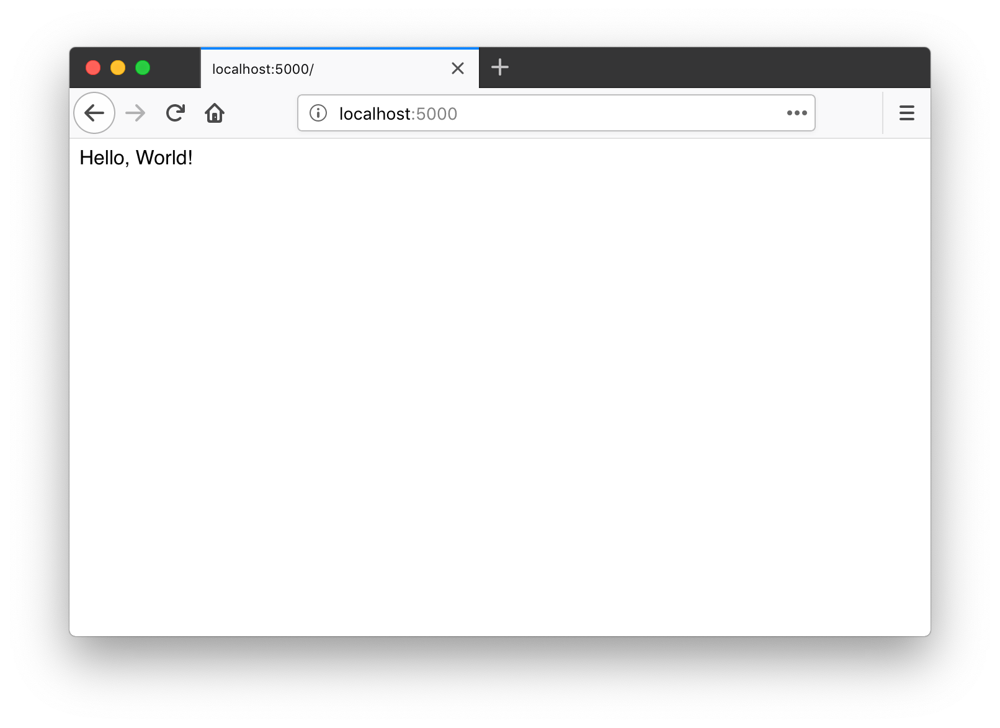

# 第 2 章：Hello, Flask!

追溯到最初，Flask 诞生于 Armin Ronacher 在 2010 年愚人节开的一个玩笑。后来，它逐渐发展成为一个成熟的 Python Web 框架，越来越受到开发者的喜爱。目前它在 GitHub 上是 Star 数量最多的 Python Web 框架，没有之一。根据 2018、2019、2020、2021 连续四年的《[Python 开发者调查报告](https://lp.jetbrains.com/python-developers-survey-2021)》统计数据，它也是目前最流行的 Python Web 框架。

Flask 是典型的微框架，作为 Web 框架来说，它仅保留了核心功能：**请求响应处理**和**模板渲染**。这两类功能分别由 Werkzeug（WSGI 工具库）完成和 Jinja（模板渲染库）完成，因为 Flask 包装了这两个依赖，我们暂时不用深入了解它们。


## 主页

这一章的主要任务就是为我们的程序编写一个简单的主页。主页的 URL 一般就是根地址，即 `/`。当用户访问根地址的时候，我们需要返回一行欢迎文字。这个任务只需要下面几行代码就可以完成：

*app.py：程序主页*

```python
from flask import Flask

app = Flask(__name__)

@app.route('/')
def hello():
    return 'Welcome to My Watchlist!'
```

按照惯例，我们把程序保存为 app.py，确保当前目录是项目的根目录，并且激活了虚拟环境，然后在命令行窗口执行 `flask run` 命令启动程序（按下 Control + C 可以退出）：

```bash
(env) $ flask run
* Serving Flask app "app.py"
* Environment: production
  WARNING: Do not use the development server in a production environment.
  Use a production WSGI server instead.
* Debug mode: off
* Running on http://127.0.0.1:5000/ (Press CTRL+C to quit)
```

现在打开浏览器，输入 <http://localhost:5000> 并按下 Enter 即可访问我们的程序主页，并看到我们在程序里返回的问候语，如下图所示：



执行 `flask run` 命令时，Flask 会使用内置的开发服务器来运行程序。这个服务器默认监听本地机的 5000 端口，也就是说，我们可以通过在地址栏输入 <http://127.0.0.1:5000> 或是 <http://localhost:5000> 访问程序。

> **注意** 内置的开发服务器只能用于开发时使用，部署上线的时候要换用性能更好的生产服务器，我们会在最后一章学习。


## 解剖时间

下面我们来分解这个 Flask 程序，了解它的基本构成。

首先我们从 `flask` 包导入 `Flask` 类，通过实例化这个类，创建一个程序对象 `app`：

```python
from flask import Flask

app = Flask(__name__)
```

接下来，我们要注册一个处理函数，这个函数是处理某个请求的处理函数，Flask 官方把它叫做视图函数（view funciton），你可以理解为“**请求处理函数**”。

所谓的“注册”，就是给这个函数戴上一个装饰器帽子。我们使用 `app.route()` 装饰器来为这个函数绑定对应的 URL，当用户在浏览器访问这个 URL 的时候，就会触发这个函数，获取返回值，并把返回值显示到浏览器窗口：

```python
@app.route('/')
def hello():
    return 'Welcome to My Watchlist!'
```

> **提示** 为了便于理解，你可以把 Web 程序看作是一堆这样的视图函数的集合：编写不同的函数处理对应 URL 的请求。

填入 `app.route()` 装饰器的第一个参数是 URL 规则字符串，这里的 `/`指的是根地址。

我们只需要写出相对地址，主机地址、端口号等都不需要写出。所以说，这里的 `/` 对应的是主机名后面的路径部分，完整 URL 就是 <http://localhost:5000/>。如果我们这里定义的 URL 规则是 `/hello`，那么完整 URL 就是 <http://localhost:5000/hello>。

整个请求的处理过程如下所示：

1. 当用户在浏览器地址栏访问这个地址，在这里即 <http://localhost:5000/>
2. 服务器解析请求，发现请求 URL 匹配的 URL 规则是 `/`，因此调用对应的处理函数 `hello()`
3. 获取 `hello()` 函数的返回值，处理后返回给客户端（浏览器）
4. 浏览器接受响应，将其显示在窗口上

> **提示** 在 Web 程序的语境下，虽然客户端可能有多种类型，但在本书里通常是指浏览器。


## 程序发现机制

如果你把上面的程序保存成其他的名字，比如 hello.py，接着执行 `flask run` 命令会返回一个错误提示。这是因为 Flask 默认会假设你把程序存储在名为 app.py 或 wsgi.py 的文件中。如果你使用了其他名称，就要设置系统环境变量 `FLASK_APP` 来告诉 Flask 你要启动哪个程序：

```bash
$ export FLASK_APP=hello.py
```

在 Windows CMD 中使用 set 命令：

```bash
> set FLASK_APP=hello.py
```

在 Windows PowerShell 中则使用下面的命令：

```bash
> $env:FLASK_APP = "hello.py"
```

Flask 通过读取这个环境变量值对应的模块寻找要运行的程序实例，你可以把它设置成下面这些值：

* 模块名
* Python 导入路径
* 文件目录路径


## 管理环境变量

现在在启动 Flask 程序的时候，我们通常要和两个环境变量打交道：`FLASK_APP` 和 `FLASK_DEBUG`。因为我们的程序现在的名字是 app.py，暂时不需要设置 `FLASK_APP`。`FLASK_DEBUG` 用来开启调试模式（debug mode）。调试模式开启后，当程序出错，浏览器页面上会显示错误信息；代码出现变动后，程序会自动重载。

下面是手动设置环境变量 `FLASK_DEBUG` 来开启调试模式的示例：

```bash
(env) $ export FLASK_DEBUG=1  # 注意在 Windows 系统使用 set 或 $env: 替代 export，参考前面的示例
(env) $ flask run
```

为了不用每次打开新的终端会话都要设置环境变量，我们安装用来自动导入系统环境变量的 python-dotenv：

```bash
(env) $ pip install python-dotenv
```

当 python-dotenv 安装后，Flask 会从项目根目录的 .flaskenv 和 .env 文件读取环境变量并设置。我们分别使用文本编辑器创建这两个文件，或是使用更方便的 `touch` 命令创建（注意不要漏掉文件名开头的点）：

```bash
$ touch .env .flaskenv
```

.flaskenv 用来存储 Flask 命令行系统相关的公开环境变量；而 .env 则用来存储敏感数据，不应该提交进 Git 仓库，我们把文件名 `.env` 添加到 .gitignore 文件的结尾（新建一行）来让 Git 忽略它。你可以使用编辑器打开这个文件，然后添加下面这一行内容：

```
.env
```

在新创建的 .flaskenv 文件里，我们写入一行 `FLASK_DEBUG=1`，将环境变量 `FLASK_DEBUG` 的值设为 `1`，以便开启调试模式：

```bash
# .flaskenv 文件
FLASK_DEBUG=1
```

顺便说一句，如果你安装的 Flask 版本是 2.3 或更高版本，则可以直接使用 `--debug` 命令行选项来开启调试模式，即：

```bash
(env) $ flask run --debug
```


## 实验时间

在这个小节，我们可以通过做一些实验，来扩展和加深对本节内容的理解。


### 修改视图函数返回值

首先，你可以自由修改视图函数的返回值，比如：

```python
@app.route('/')
def hello():
    return '欢迎来到我的 Watchlist！'
```

返回值作为响应的主体，默认会被浏览器作为 HTML 格式解析，所以我们可以添加一个 HTML 元素标记：

```python
@app.route('/')
def hello():
    return '<h1>Hello Totoro!</h1>'
```

保存修改后，只需要在浏览器里刷新页面，你就会看到页面上的内容也会随之变化。


### 修改 URL 规则

另外，你也可以自由修改传入 `app.route` 装饰器里的 URL 规则字符串，但要注意以斜线 `/` 作为开头。比如：

```python
@app.route('/home')
def hello():
    return 'Welcome to My Watchlist!'
```

保存修改，这时刷新浏览器，则会看到一个 404 错误提示，提示页面未找到（Page Not Found）。这是因为视图函数的 URL 改成了 `/home`，而我们刷新后访问的地址仍然是旧的 `/`。如果我们把访问地址改成 <http://localhost:5000/home>，就会正确看到返回值。

一个视图函数也可以绑定多个 URL，这通过附加多个装饰器实现，比如：

```python
@app.route('/')
@app.route('/index')
@app.route('/home')
def hello():
    return 'Welcome to My Watchlist!'
```

现在无论是访问 <http://localhost:5000/>、<http://localhost:5000/home> 还是 <http://localhost:5000/index> 都可以看到返回值。

在前面，我们之所以把传入 `app.route` 装饰器的参数称为 URL 规则，是因为我们也可以在 URL 里定义变量部分。比如下面这个视图函数会处理所有类似 `/user/<name>` 的请求：

```python
@app.route('/user/<name>')
def user_page(name):
    return 'User page'
```

不论你访问 <http://localhost:5000/user/greyli>，还是 <http://localhost:5000/user/peter>，抑或是 <http://localhost:5000/user/甲>，都会触发这个函数。通过下面的方式，我们也可以在视图函数里获取到这个变量值：

```python
from markupsafe import escape

@app.route('/user/<name>')
def user_page(name):
    return f'User: {escape(name)}'
```

> **注意** 用户输入的数据会包含恶意代码，所以不能直接作为响应返回，需要使用 MarkupSafe（Flask 的依赖之一）提供的 `escape()` 函数对 `name` 变量进行转义处理，比如把 `<` 转换成 `&lt;`。这样在返回响应时浏览器就不会把它们当做代码执行。


### 修改视图函数名？

最后一个可以修改的部分就是视图函数的名称了。首先，视图函数的名字是自由定义的，和 URL 规则无关。和定义其他函数或变量一样，只需要让它表达出所要处理页面的含义即可。

除此之外，它还有一个重要的作用：作为代表某个路由的端点（endpoint），同时用来生成视图函数对应的 URL。对于程序内的 URL，为了避免手写，Flask 提供了一个 `url_for` 函数来生成 URL，它接受的第一个参数就是端点值，默认为视图函数的名称：

```python
from flask import url_for
from markupsafe import escape

# ...

@app.route('/')
def hello():
    return 'Hello'

@app.route('/user/<name>')
def user_page(name):
    return f'User: {escape(name)}'

@app.route('/test')
def test_url_for():
    # 下面是一些调用示例（请访问 http://localhost:5000/test 后在命令行窗口查看输出的 URL）：
    print(url_for('hello'))  # 生成 hello 视图函数对应的 URL，将会输出：/
    # 注意下面两个调用是如何生成包含 URL 变量的 URL 的
    print(url_for('user_page', name='greyli'))  # 输出：/user/greyli
    print(url_for('user_page', name='peter'))  # 输出：/user/peter
    print(url_for('test_url_for'))  # 输出：/test
    # 下面这个调用传入了多余的关键字参数，它们会被作为查询字符串附加到 URL 后面。
    print(url_for('test_url_for', num=2))  # 输出：/test?num=2
    return 'Test page'
```

实验过程中编写的代码可以删掉，也可以保留，但记得为根地址返回一行问候，这是我们这一章的任务。


## 本章小结

这一章我们为程序编写了主页，同时学习了 Flask 视图函数的基本编写方式。结束前，让我们提交代码：

```bash
$ git add .
$ git commit -m "Add minimal home page"
$ git push
```

为了保持简单，我们统一在章节最后一次提交所有改动。在现实世界里，通常会根据需要分为多个 commit；同样的，这里使用 `-m` 参数给出简单的提交信息。在现实世界里，你可能需要撰写更完整的提交信息。

> **提示** 你可以在 GitHub 上查看本书示例程序的对应 commit：[eca06dc](https://github.com/helloflask/watchlist/commit/eca06dcdf682dfa2883a8632814e4c65b6eae141)。


## 进阶提示

* 对于 URL 变量，Flask 支持在 URL 规则字符串里对变量设置处理器，对变量进行预处理。比如 `/user/<int:number>` 会将 URL 中的 number 部分转换成整型。
* 因为 Flask 的上下文机制，有一些变量和函数（比如 `url_for`函数）只能在特定的情况下才能正确执行，比如视图函数内。我们先暂时不用纠结，后面再慢慢了解。
* 名字以 `.` 开头的文件默认会被隐藏，执行 `ls` 命令时会看不到它们，这时你可以使用 `ls -f` 命令来列出所有文件。
* 了解 HTTP 基本知识将会有助于你了解 Flask 的工作原理。
    * 阅读文章[《互联网是如何工作的》](https://tutorial.djangogirls.org/zh/how_the_internet_works/)。
    * 阅读文章[《从 HTTP 请求 - 响应循环探索 Flask 的基本工作方式》](https://zhuanlan.zhihu.com/p/42231394)。
* 如果你是[《Flask Web 开发实战》](http://helloflask.com/book/1)的读者，这部分的进阶内容可以在第 1 章《初识 Flask》和第 2 章《HTTP 和 Flask》找到。
